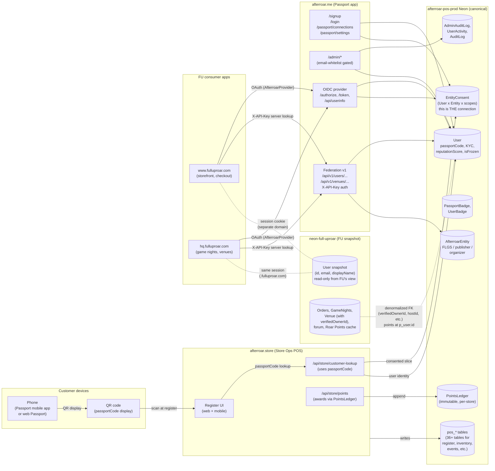
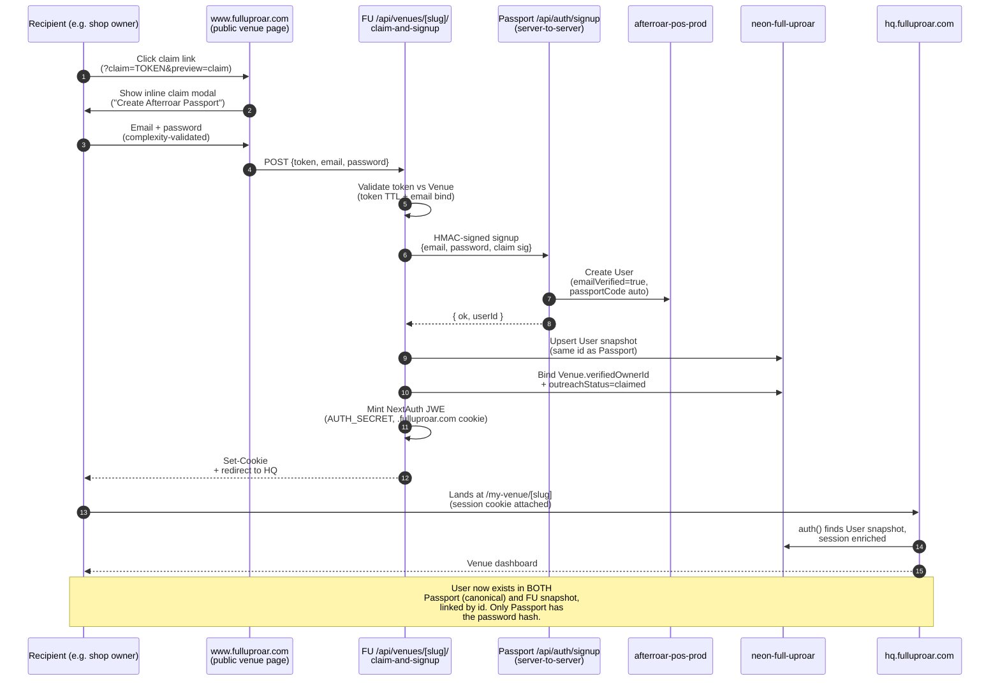
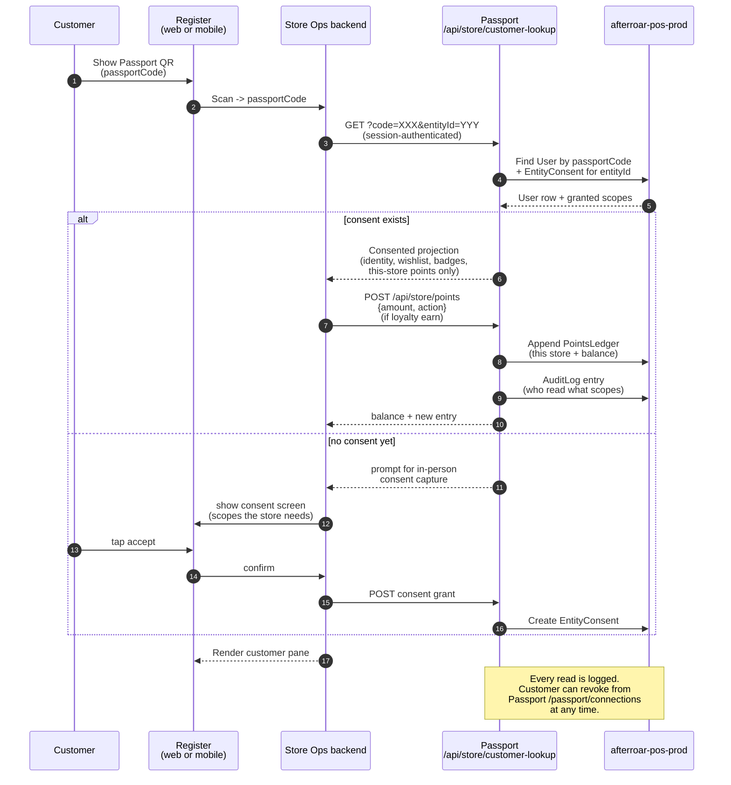
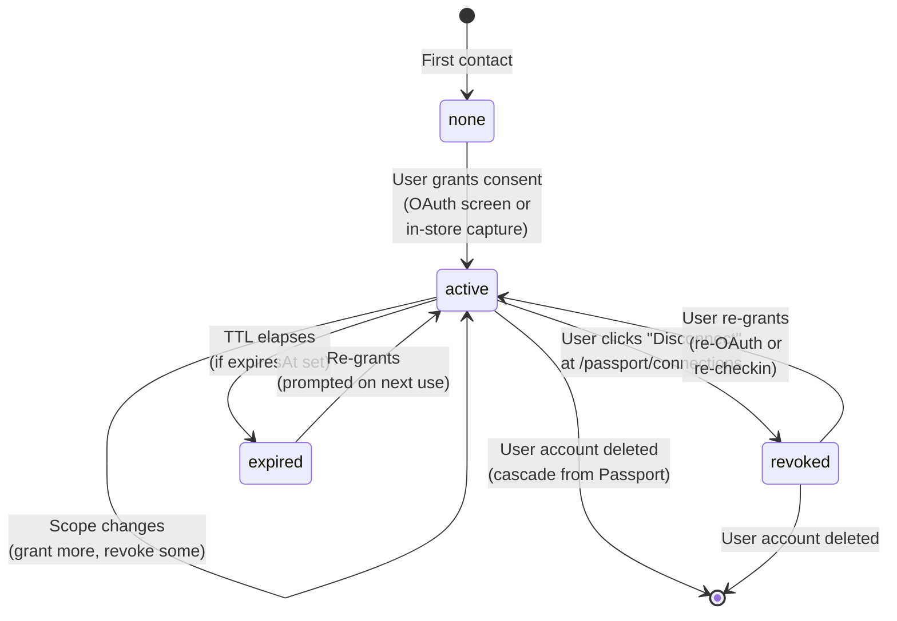
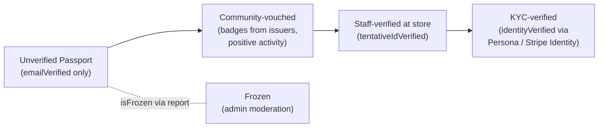

# Passport: System diagram

How Afterroar Passport (afterroar.me) works across online and in-store
contexts. Companion to `PASSPORT_AS_CANONICAL_IDENTITY.md`.

Last updated 2026-05-19.

---

## 1. Landscape — apps, data, and the federation edge

**Key invariants:**

- `passport_neon` is canonical. Every identity primitive lives here.
- `fu_neon`'s User table is a denormalized snapshot. FU code reads it
  freely; mutations to identity (display name, KYC, ban state) must
  originate at Passport and propagate.
- Cross-DB references between Neon projects are app-level lookups, not
  SQL FKs. There is no Prisma relation between `fu_data.verifiedOwnerId`
  and `p_user.id` at the DB layer.
- Connections between a user and a tenant are represented by
  `EntityConsent` rows on Passport. Revoking the row IS disconnecting.

---

## 2. Online flow — claim a venue from FU outreach

A first-time user clicks the magic link in an Afterroar outreach email
and ends up running their FLGS's HQ dashboard. Sequence below.

---

## 3. In-store flow — checkin at the register

---

## 4. Connection lifecycle (the EntityConsent primitive)

**Disconnect semantics (2026-05-19 architectural call):**

- Revoking an `EntityConsent` row IS the disconnect action.
- The connected app's lookups return null/403 for that user afterwards.
- Historical records on the connected app's side (orders, game nights
  hosted, etc.) are anonymized rather than deleted — they keep an
  opaque user id reference for FK integrity but the connection is dead.
- Re-granting consent re-establishes the connection. Same `passportCode`
  comes back online for that tenant.

**Deletion vs disconnection:**

- **Disconnect a single tenant**: revoke that `EntityConsent` row. Lives
  on the Passport user-facing surface at `/passport/connections`.
- **Delete the whole Passport identity**: nukes the canonical `User`
  row. All `EntityConsent` rows cascade to deletion (FK cascade).
  Lives on the Passport admin surface at `/admin/users`. Also available
  to the user as "Delete my account" on `/passport/settings`.

---

## 5. Federation API surface (X-API-Key)

What Passport exposes for server-to-server use by FU/HQ/partner apps.

| Endpoint | Used by | Purpose |
|---|---|---|
| `GET /api/v1/users/{id}` | FU, HQ | Single-user lookup |
| `POST /api/v1/users/lookup` | FU, HQ | Batch lookup (≤100 ids) |
| `GET /api/v1/events/by-afterroar-id/{id}/checkins` | HQ | Event roster sync |
| `GET /api/v1/venues/{id}/inventory` | HQ | Store inventory readout |
| `GET /api/v1/venues/{id}/revenue?period=N` | HQ | Revenue aggregation |
| **Missing today (next sprints):** | | |
| `GET /api/v1/users/{id}?include=summary` | FU/HQ admin | Connection counts before destructive ops |
| `DELETE /api/v1/users/{id}` | FU/HQ admin | Nuclear user delete (rare; usually done from Passport admin directly) |
| `PATCH /api/v1/users/{id}` | FU/HQ admin | Identity-state sync (ban, KYC verify) |
| `POST /api/v1/webhooks/subscribe` | partner apps | Receive `connection.revoked`, `user.deleted` events |

---

## 6. Where each operator action lives (2026-05-19)

| Action | Lives at | Why |
|---|---|---|
| User self-disconnects from a tenant | Passport `/passport/connections` | Passport owns the connection primitive |
| User self-deletes their entire account | Passport `/passport/settings` | Canonical store of identity |
| Admin deletes a user (canonical) | Passport `/admin/users` (iframed into FU AdminApp under "Passport") | Single canonical surface |
| Admin views/manages venues | HQ `/admin/venue-claims`, `/admin/outreach` (iframed into FU AdminApp under "Governance (HQ)") | Venue admin tools live on HQ |
| FU-side admin ops (orders, merch, etc.) | FU `/admin` | Tenant-specific |

Three iframed admin contexts, one operator pane at `www.fulluproar.com/admin`.

---

## 7. Trust ladder

Reputation and verification layers from cheapest to strongest.

- **Unverified**: anyone with an email. Lowest reputation weight. Can
  RSVP, can claim libraries, can earn store points.
- **Community-vouched**: badges issued by other Passport holders or
  stores. Useful for events that gate on "regular here" / "trusted by N
  members of this crew."
- **Staff-verified**: a store has checked the customer's physical ID
  and tagged the Passport. Local to that store; not network-wide.
- **KYC-verified**: third-party identity service (Persona, Stripe
  Identity) has confirmed real-world identity. Required for prize-money
  tournaments, alcohol-event RSVPs, high-value trade-ins, business
  ownership verification.

---

## 8. Open architectural threads (as of 2026-05-19)

- Passport's `User` table has no role enum. Admin gate is an email
  whitelist hardcoded in `lib/admin.ts`. Doesn't scale to a 3rd admin
  cleanly — promote to a `User.adminRole` enum + persisted ACL.
- No abuse-report / user-block models in the Passport schema yet. The
  reputation system has the scores but not the actions that move them.
- Webhook delivery (Passport → consumer apps for `connection.revoked`,
  `user.deleted`) is not built. Today consumer apps poll or notice on
  next federation lookup.
- The "delete me" self-service path on Passport is referenced in this
  doc but not yet built. See followup sprint.
